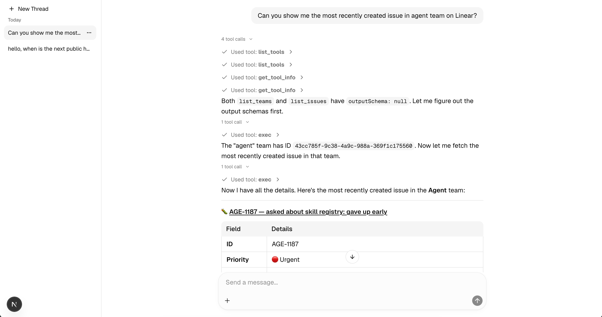

# examples/assistant-ui-react

A Next.js chat app that demonstrates [`truefoundry-agents-assistant-ui-runtime`](../../packages/truefoundry-agents-assistant-ui-runtime) wired to a live TrueFoundry Gateway agent.



Features shown:
- Session list sidebar with thread history
- Streaming assistant responses with reasoning blocks
- Tool approval (Allow / Deny) UI
- Ask-user question flows
- MCP OAuth auth prompts
- File attachment forwarding

## Prerequisites

- Node.js 20+
- pnpm 10+
- A running TrueFoundry Gateway agent and an API key

## Running the example

1. **Install dependencies** from the repo root (this also builds the runtime package):

   ```bash
   # from repo root: truefoundry-agents-assistant-ui-runtime/
   pnpm install
   pnpm build
   ```

2. **Start the dev server:**

   ```bash
   pnpm dev
   # or, scoped:
   pnpm --filter assistant-ui-react dev
   ```

   The app starts at [http://localhost:3000](http://localhost:3000).

3. **Connect your gateway.** On first load you will see a credentials form. Paste your `.env` content:

   ```
   TFY_API_KEY=your-api-key-here
   TFY_GATEWAY_URL=https://gateway.truefoundry.ai/<your-tenant>
   ```

   Copy `.env.example` as a reference.

4. **Set your agent name.** Include `TFY_AGENT_NAME` in the `.env` content you paste into the credentials form:

   ```
   TFY_AGENT_NAME=your-agent-name
   ```

## Key files

| File | Role |
|------|------|
| `src/app/TrueFoundryAgentRuntimeProvider.tsx` | Wires `useTrueFoundryAgentRuntime` and `AssistantRuntimeProvider` |
| `src/lib/chat/agentClient.ts` | Creates `AgentSessionClient` from credentials |
| `src/lib/chat/gatewayCredentials.tsx` | Credentials input form + React context |
| `src/components/assistant-ui/thread.tsx` | Main chat thread UI |
| `src/components/assistant-ui/thread-list.tsx` | Sidebar session list |
| `src/components/assistant-ui/tool-fallback.tsx` | Tool call UI with approval and sub-agent nesting |

> **Note:** The API key is stored only in browser memory for the lifetime of the page. This is intended for local development and demos, not production deployments.
